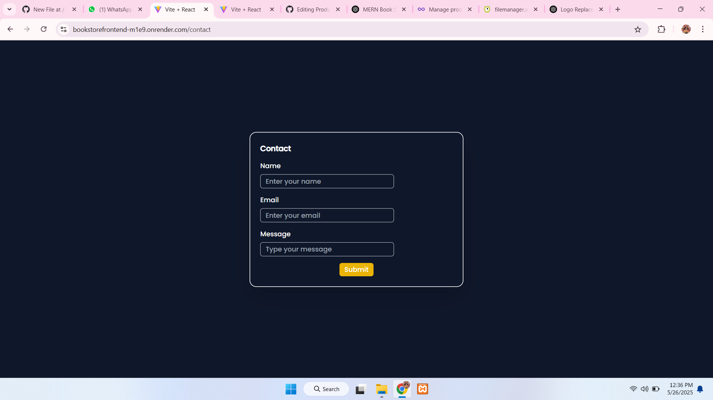
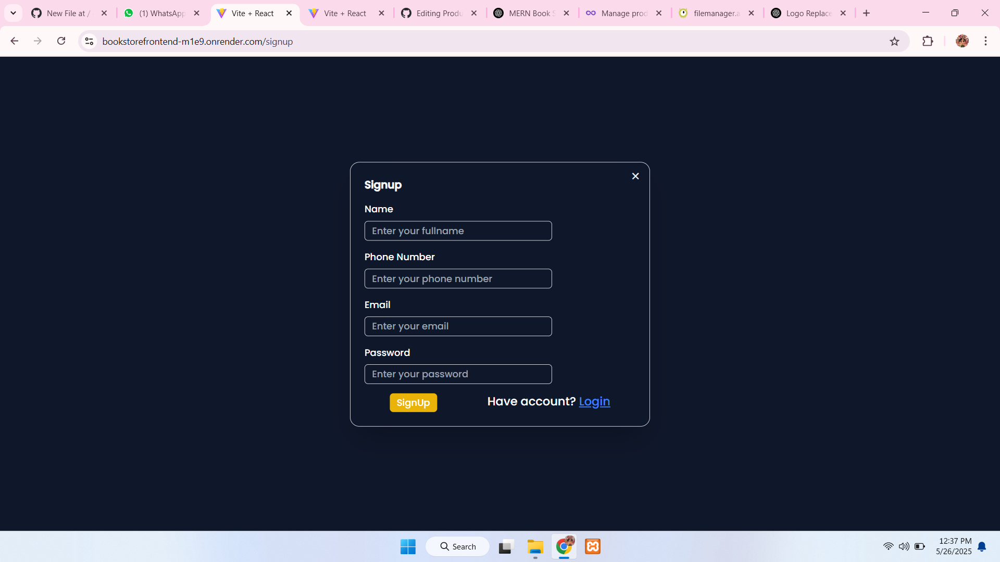
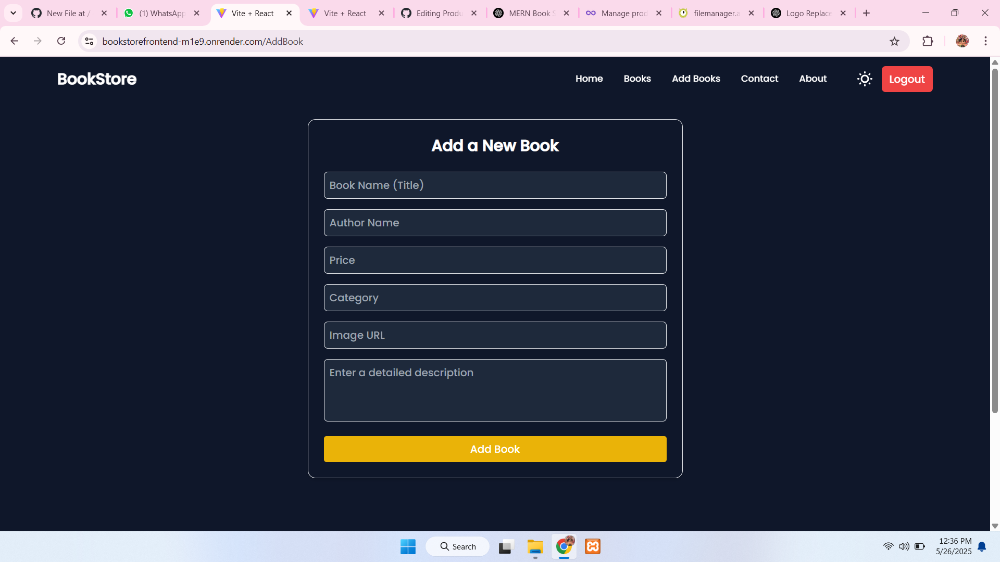

# 📚 MERN Book Store

Welcome to the **Book Store Web App**, a full-stack project built with the **MERN stack (MongoDB, Express, React, Node.js)**. It allows users to browse, add, update, and delete books. The app also includes secure user authentication, a clean UI, and admin capabilities for managing book inventory.

🚀 [Live Demo](https://bookstorefrontend-m1e9.onrender.com)

## 🛠️ Tech Stack

**Frontend:**
- React
- Axios
- React Router
- Tailwind CSS 

**Backend:**
- Node.js
- Express.js
- MongoDB with Mongoose
- Authentication

**Other Tools:**
- Render (for deployment)
- MongoDB Atlas (cloud database)

---

## 🔧 Features

- 📖 View list of books
- ➕ Add new books
- ✏️ Edit existing books
- 🗑️ Delete books
- 🔐 user authentication
- 🖼️ Upload book cover images 

---

## 📸 Screenshots

### 🔐 Login Page

---

### 📝 Register Page

---

### 🏠 Home Dashboard

---

### 📘 Add Book 

---
